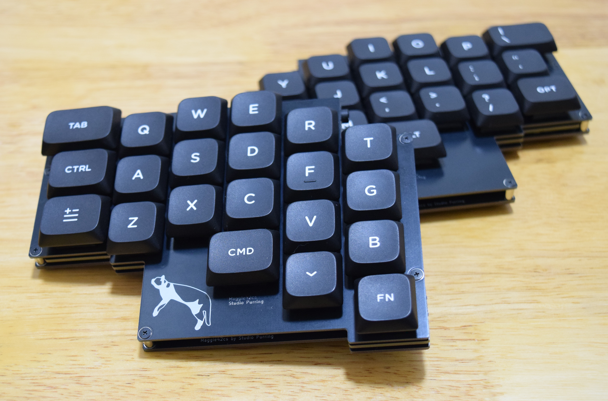
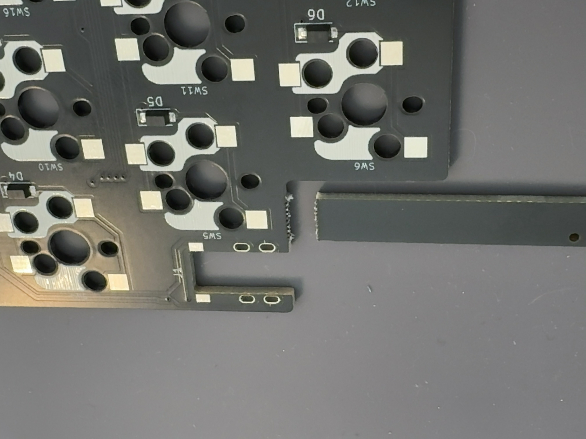
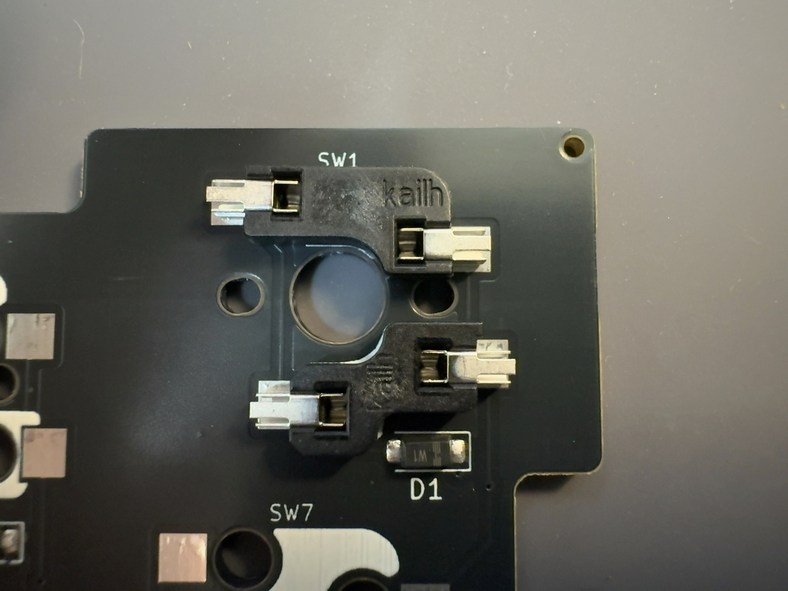
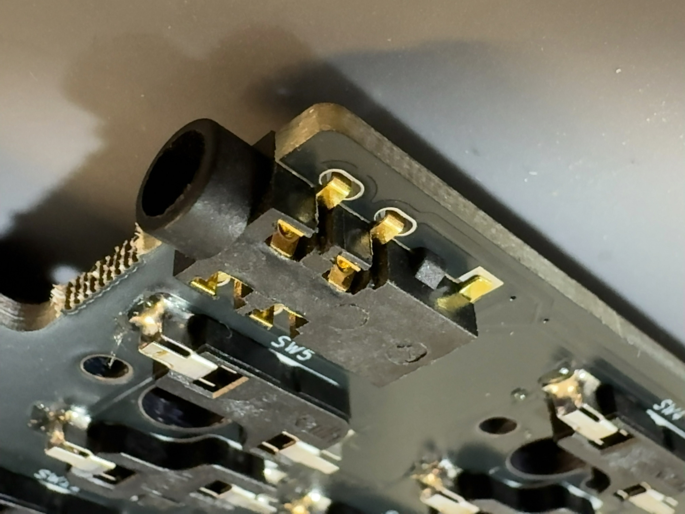
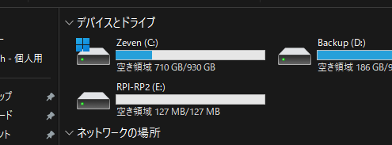
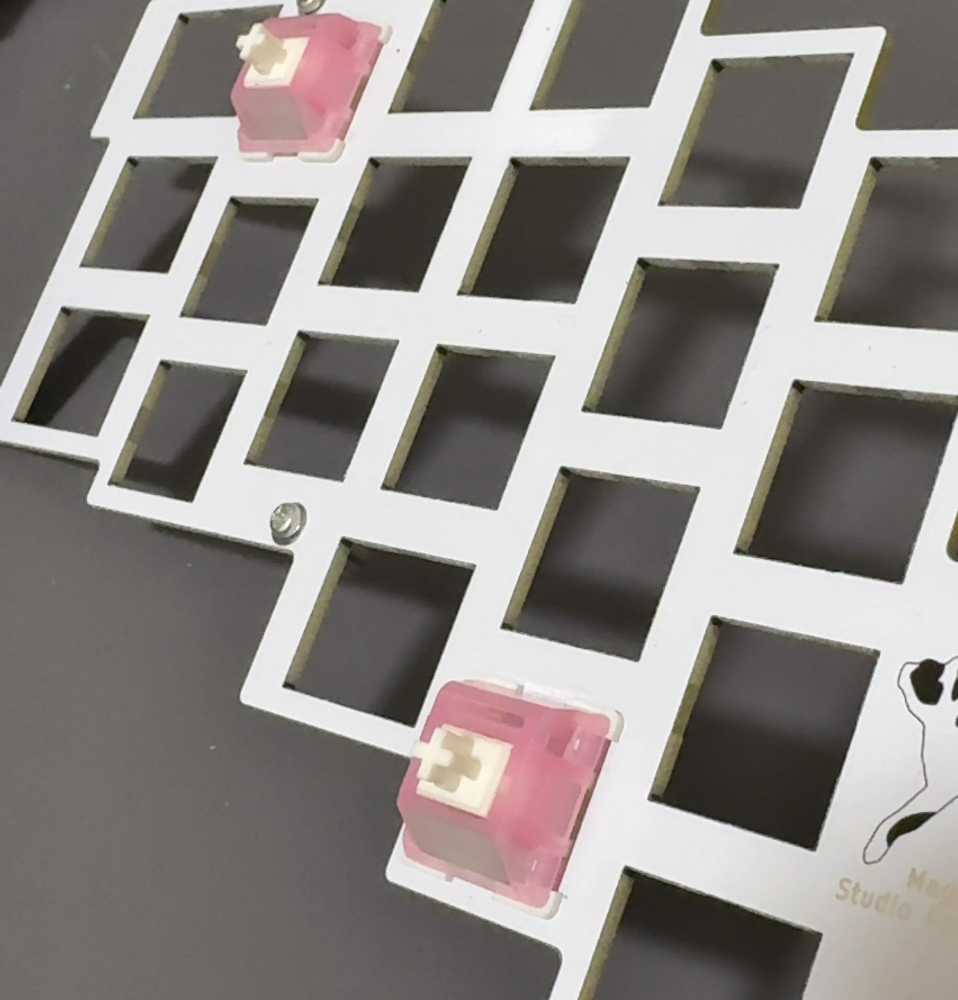
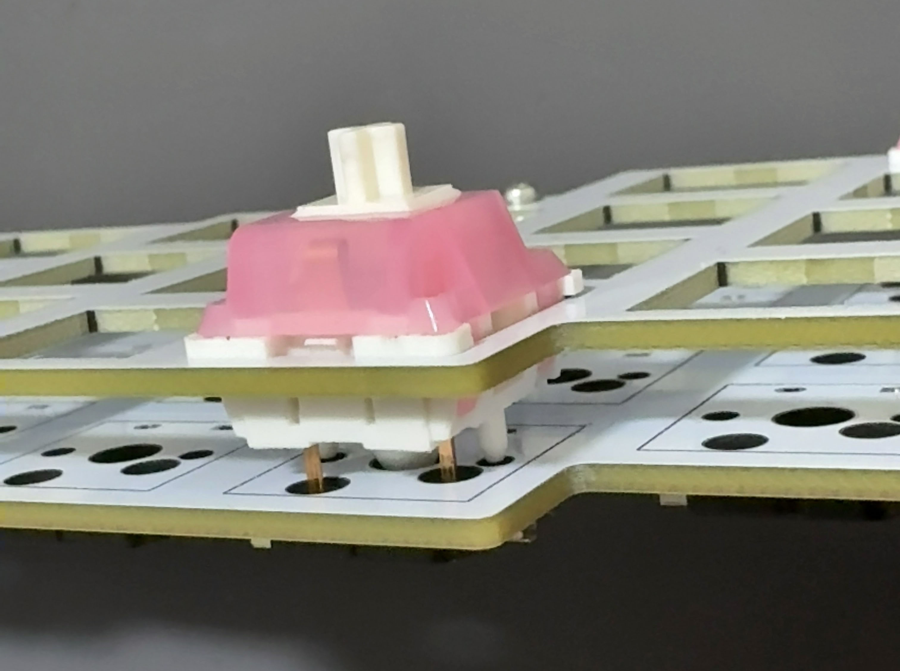
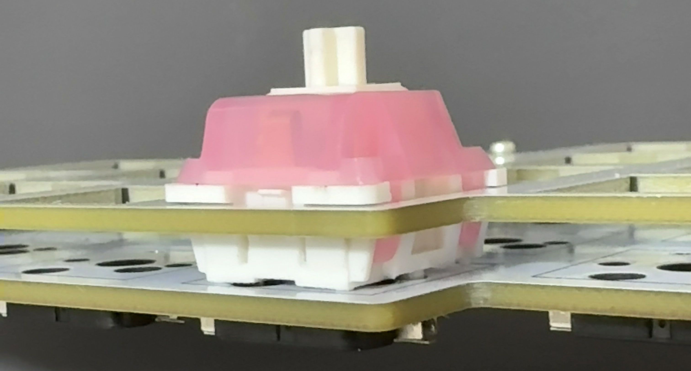
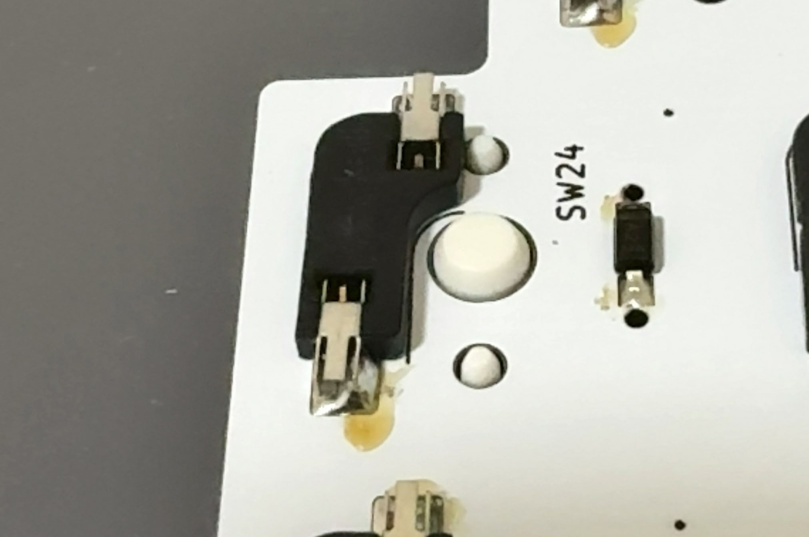
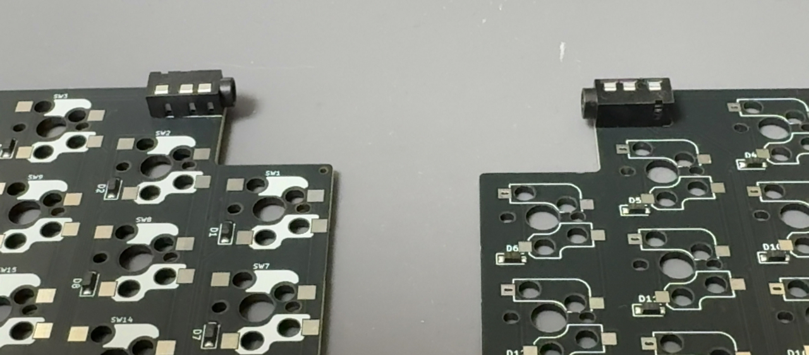

# Maggie42cs

Maggie42csは42キー分割型の自作キーボードです。
- 左右対称カラムスタッガード
- Alice配列に似た、自然にハの字に手が配置されるデザイン
- MX Cherry 互換スイッチ、Kailh Choc v1, v2スイッチの3種に対応
- Extension キーはキーキャップセットで揃いやすい1.25U, 1.5Uに対応

## 必要なもの

| 部品名称                | 数量（両手分）                 | 備考                                   | 主な購入先                                                          |
| ----------------------  | ------------------------------ | -------------------------------------- | ------------------------------------------------------------------- |
| PCB                     | 1                              | サポートを折って左右に分けます         |                                                                     |
| トッププレート          | 2                              | 猫のシルエットがあるのが左側           |                                                                     |
| ボトムプレート          | 2                              | 左右の差はありません                   |                                                                     |
| ネジ                    | 24                             | M2                                     |                                                                     |
| 丸スペーサー            | 12                             | 5mm or 7.5mm                           |                                                                     |
| ゴム足                  | 8                              |                                        |                                                                     |
| スイッチソケット        | 42                             | Cherry MX / Kailh choc 対応のもの      | [TALP KEYBOARD](https://shop.talpkeyboard.com) など                 |
| メカニカルスイッチ      | 42                             | Cherry MX / Kailh choc V1 / V2 対応*   | [遊舎工房](https://shop.yushakobo.jp/collections/all-switches) など |
| キーキャップ            | 1U x 33, 1.25U x 7, 1.5U x 2   | スイッチに対応したもの                 | [遊舎工房](https://shop.yushakobo.jp/collections/keycaps) など      |
| TRSコネクター           | 2                              | PJ-399B-6A                             | [LCSC](https://www.lcsc.com/) など                                  |
| 3.5mmオーディオケーブル | 1                              | TRRS（4極）またはTRS（3極）            | [TALP KEYBOARD](https://shop.talpkeyboard.com) など                 |
| USBケーブル             | 1                              | 機器側がTypeCのもの                    | 家電量販店など                                                      |

## 使用する工具など

- はんだ付け工具
  - こて、こて台、こて先クリーナー、はんだ線など
- 精密ドライバー

## あると便利なもの

- ピンセット
- キースイッチプラー
- キーキャッププラー
- はんだ吸い取り線または吸い取り器
- 絶縁耐熱テープ
- 
## 製作手順

1. PCBのサポート部分を折り取ります。折った部分のデコボコが気になる場合はやすりなどで削ってください。
   
1. ソケットをはんだ付けします。  
   MXスイッチ用のソケットは上側、Chocスイッチ用のソケットは下側に設置します。  
   印刷に合わせて、スイッチの穴を塞がないようにします。
   
1. TRSコネクターをはんだ付けします。  
   ずれやすいのでテープなどで固定してください。  
   
1. ファームウェアのファイル（.uf2）をダウンロードします。  
   https://github.com/tamaroh/maggie42cs/releases/tag/V2.0.2
1. （片側ずつ両方とも）USBケーブルを接続して、以下のいずれかの方法で `RPI-RP2` リムーバブルドライブをマウントさせます。
   1. BOOTSELボタンを押しながら、USBケーブルを接続します。
   1. USBケーブルを接続してから、BOOTSELボタンを押しながらRESETボタンを押します。
   1. 左側はTABキー、右側はYキーを押したままUSBケーブルを接続します（キースイッチ装着済みの場合）。
   
1. （片側ずつ両方とも）マウントされた `RPI-RP2` ドライブ内にファームウェアのファイルをコピーして保存します。
   自動的にマウントが解除され、キーボードが再起動します。
   再起動したら、一度USBケーブルを抜いてください。
1. キースイッチを数個、先にキープレートに差し込みます。キープレートの表裏は印字以外にはありません。
   
1. スイッチのピンがソケットに合うように上からまっすぐ抑え、基板と接続して位置を合わせます。
   
   
1. 残りのスイッチを差し込みます。ソケットとスイッチを指で挟み込むようにして、ソケットに確実に差し込みます。
1. 基板を裏返し、ソケットからスイッチの端子の先端が見えることを確認してください。見えない場合はスイッチのピンが曲がっているか、ソケットの不良です。
   
1. ネジとスペーサーをトッププレートにネジ止めします。(片側6箇所) 
1. ボトムプレートをネジ止めし、ゴム足を取り付けます。
1. キーキャップを取り付けます。
1. TRRSケーブルを接続して、できあがり

## キーマップを変更する

Maggie42は[Remap](https://remap-keys.app)によるキーマップ変更に対応しています。  
ハードウェア接続のあとJSONファイルを要求される場合は[ファームウェアと同じ場所](https://github.com/tamaroh/maggie42cs/releases/tag/V2.0.2)からダウンロードして使用してください。

## 注意事項

- 必要な手順や部品の種類・数はアップデートによって変更になる場合があります。
- 本ビルドガイドの写真の一部は製品と異なる場合があります。

## 実装の差異について

キーケット2026にて販売した一部のキットは、製作の時期により差異があります。
- 手順と異なる4極の3.5mmコネクターがはんだ実装済みです。したがって、TRSケーブルではなくTRRS（4極）ケーブルが必要です。
- 左右でPCBの印字の色が異なります。
  
- 手順通りのファームウェアとは異なります。書き込み済みで販売いたしましたが、再度セットアップする場合は[V2.0.0のファームウェア](https://github.com/tamaroh/maggie42cs/releases/tag/V2.0.0)を使用してください。
- Remapにアクセスした際は「maggie42csv2」と表示されます。
